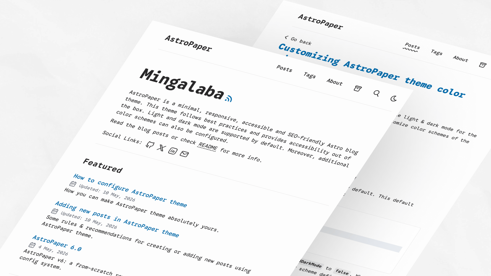
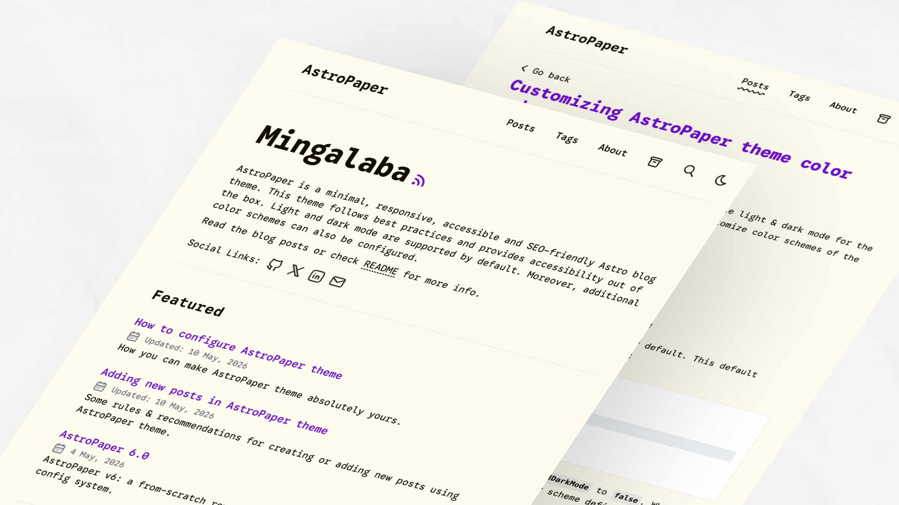
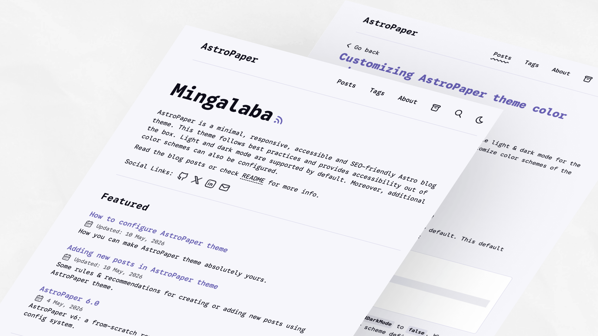
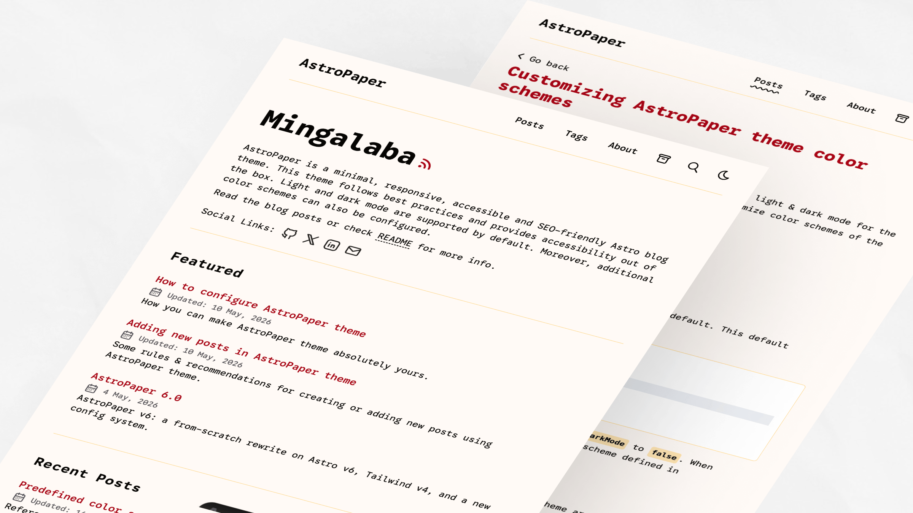
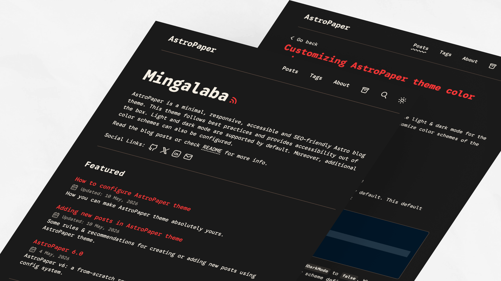

import ResponsiveTable from '@/components/ResponsiveTable.astro';

AstroPaper 内置多套预设配色，可用于自定义主题外观。每套方案都为浅色和深色模式定义了一组完整的 CSS 自定义属性（变量）。

## 目录

## 快速开始

要应用预设配色，只需将对应的 CSS 变量定义复制到主题配置中。详细设置步骤请参阅[配色配置指南](https://astro-paper.pages.dev/posts/customizing-astropaper-theme-color-schemes/)。

## CSS 变量参考

所有配色方案都使用以下 CSS 自定义属性：

<ResponsiveTable variant="striped-minimal">

| 变量                  | 用途                                             |
| --------------------- | ------------------------------------------------ |
| `--background`        | 主要背景颜色                                     |
| `--foreground`        | 主要文本颜色                                     |
| `--accent`            | 强调色／交互元素颜色，如链接、按钮和高亮         |
| `--accent-foreground` | 强调色背景上的文本颜色                           |
| `--muted`             | 用于次要区域的柔和背景色                         |
| `--muted-foreground`  | 次要内容的文本颜色                               |
| `--border`            | 边框和分隔线颜色                                 |

</ResponsiveTable>

## 浅色配色

浅色配色使用 CSS 选择器 `:root` 和 `[data-theme="light"]` 定义。

### Paper Light

AstroPaper 默认浅色主题。



```css
:root,
[data-theme="light"] {
  --background: #fdfdfd;
  --foreground: #282728;
  --accent: #006cac;
  --accent-foreground: #ffffff;
  --muted: #e6e6e6;
  --muted-foreground: #6b7280;
  --border: #ece9e9;
}
```

### Kha-Yan

以紫色为重点、搭配暖色背景的浅色方案。



```css
:root,
[data-theme="light"] {
  --background: #fefaec;
  --foreground: #120e01;
  --accent: #6e10cf;
  --accent-foreground: #fefaec;
  --muted: #dcdcdc;
  --muted-foreground: #6b7280;
  --border: #cdc4d6;
}
```

### Nila

带有冷蓝色调的浅紫色方案。



```css
:root,
[data-theme="light"] {
  --background: #f6f6fb;
  --foreground: #0c0c19;
  --accent: #6760b4;
  --accent-foreground: #f3f3f3;
  --muted: #dddcea;
  --muted-foreground: #54515b;
  --border: #d8d6ec;
}
```

### Jadeite

中性背景搭配蓝绿色强调色的浅色方案。


```css
:root,
[data-theme="light"] {
  --background: #f6fcf7;
  --foreground: #060b07;
  --accent: #027c6d;
  --accent-foreground: #ffffff;
  --muted: #c9e4e2;
  --muted-foreground: #6b7280;
  --border: #d4e1df;
}
```

### Pyit Tine Htaung

带有暖色调和红金强调色的方案。



```css
:root,
[data-theme="light"] {
  --background: #fffaf6;
  --foreground: #060503;
  --accent: #aa0215;
  --accent-foreground: #ffcf75;
  --muted: #ffdc98;
  --muted-foreground: #54515b;
  --border: #ffdc98;
}
```

## 深色配色

深色配色使用 CSS 选择器 `[data-theme="dark"]` 定义。

### Paper Dark

AstroPaper 最初的深色主题，使用青色强调色。


```css
[data-theme="dark"] {
  --background: #2f3741;
  --foreground: #e6e6e6;
  --accent: #1ad9d9;
  --accent-foreground: #0d2b2b;
  --muted: #596b81;
  --muted-foreground: #8faabb;
  --border: #3b4655;
}
```

### Paper Dark II

当前默认深色主题，使用橙色强调色。


```css
[data-theme="dark"] {
  --background: #212737;
  --foreground: #eaedf3;
  --accent: #ff6b01;
  --accent-foreground: #ffffff;
  --muted: #343f60;
  --muted-foreground: #afb9ca;
  --border: #ab4b08;
}
```

### Deep Purple

使用鲜明洋红色强调色的深色方案。


```css
[data-theme="dark"] {
  --background: #212737;
  --foreground: #eaedf3;
  --accent: #eb3fd3;
  --accent-foreground: #1a0d1a;
  --muted: #513f51;
  --muted-foreground: #c09abc;
  --border: #642451;
}
```

### Ember

采用红色强调色、温暖而柔和的深色方案。



```css
[data-theme="dark"] {
  --background: #1a1a1a;
  --foreground: #f5efe4;
  --accent: #ff3737;
  --accent-foreground: #1a1a1a;
  --muted: #38342f;
  --muted-foreground: #a59a8c;
  --border: #6f5648;
}
```

### Espresso

以棕色为主的温暖深色方案。


```css
[data-theme="dark"] {
  --background: #2f2f2f;
  --foreground: #ebe5e1;
  --accent: #ee781e;
  --accent-foreground: #1a1a1a;
  --muted: #4f4b44;
  --muted-foreground: #ddbfa7;
  --border: #6f5648;
}
```
